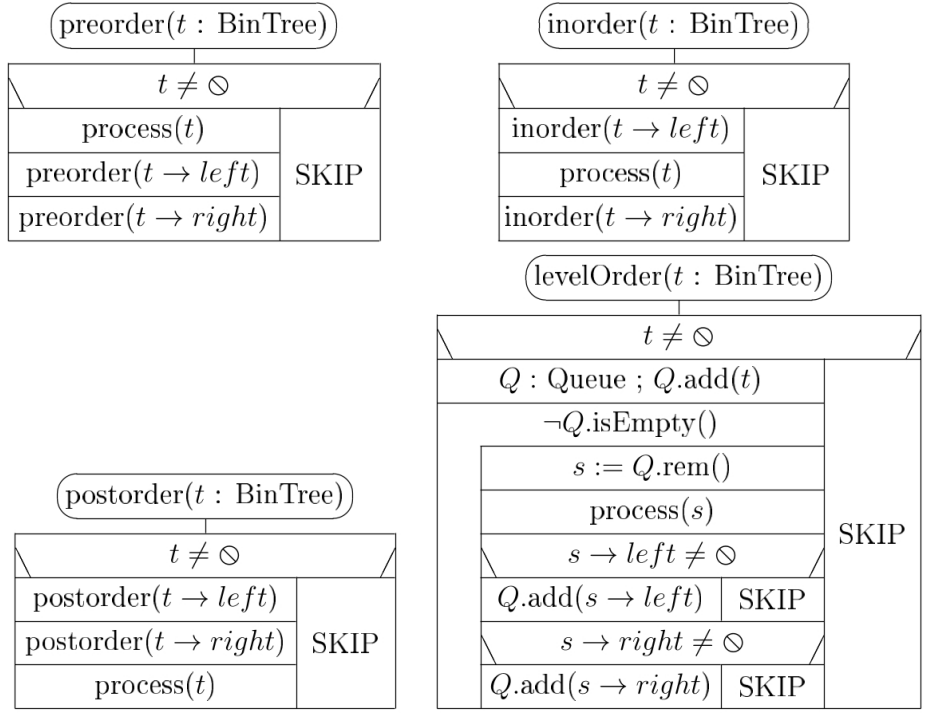
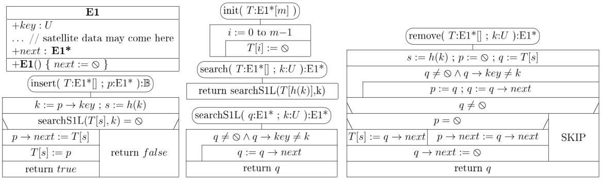

<div style="text-align: justify">

# 15. Adatszerkezetek és adattípusok

## Tartalom
[Tömb](#tömb), [verem](#verem), [sor](#sor), [láncolt listák](#láncolt-listák);
[bináris fa](#bináris-fa), [általános fa](#általános-fa), bejárások ([link](#bejárások) és [link](#bejárások-1)), ábrázolások ([link](#ábrázolások) és [link](#ábrázolások-1));
[bináris kupac](#bináris-kupac), [prioritásos sor](#prioritásos-sor); [bináris keresőfa](#bináris-keresőfa) és [műveletei](#műveletei), [AVL fa](#avl-fa), [B+ fa](#b-fa);
[hasító táblák](#hasító-táblák), [hasító függvények](#hasító-függvények), [kulcsütközés](#kulcsütközés) és feloldásai: [láncolással](#feloldása-láncolással), [nyílt címzéssel](#feloldása-nyílt-címzéssel), [próbasorozat](#próbasorozat);
[gráfok ábrázolásai](#gráfok-ábrázolásai).


## Típus
```latex
% Szimbóluma Latex-ben
\usepackage{amsmath}
\DeclareRobustCommand{\specialT}{\mathord{\text{\usefont{U}{eus}{m}{n}T}}}
$\specialT$
```
A Markdown-beli Latex limitációi miatt ehelyett: T.

A T alapértelmezésben olyan ismert (de közelebbről meg nem nevezett) típust jelöl, amelyen értékadás (pl. x := y) és általában teljes rendezés (az =,%,<,>, <=, >= összehasonlításokkal) van értelmezve.


## Tömb
Feltesszük, hogy tetszőleges tömb egy ún. tömb-objektumból és egy mutatóból áll, ami a tömb-objektumra hivatkozik.
A tömb-objektum a tömb hosszát (azaz elemszámát) és elemeit tartalmazza.
A tömb tehát ismeri a saját méretét. Az A tömb mérete pl. `A.length`, ami nem változtatható meg.

### Deklaráció és törlés
Az `A: T[n]` tömb deklaráció kiértékelése létrehoz egy T elemtípusú, n elemű tömb-objektumot ($n \in \mathbb{N}$), és az `A: T[]` típusú tömb-mutatót, ami a tömb-objektumra hivatkozik. Feltesszük, hogy a deklarációt tartalmazó programblokk befejeződésekor a tömb-mutatóval együtt a tömb-objektum is automatikusan törlődik.

Új tömb-objektumot dinamikusan pl. a new T[n] kifejezéssel hozhatunk létre, ami egy n elemű, T elemtípusú tömb-objektumot hoz létre, és a címét visszaadja.
A new utasítással létrehozott objektumok törlésére a delete utasítás szolgál.

### Indexelés
A tömböket alapértelmezésben 0-tól indexeljük.
Ha a tömböt nem nullától szeretnénk indexelni, azt pl. a `B/k: T[n]` deklarációval érhetjük el. Ekkor a B tömb hossza szintén n, de k-tól indexeljük, ahol $k \in \mathbb{Z}$.

### Tömb alprogram paramétereként
**Formális paraméter:** ami az alprogram deklarációjában van, pl. `public void f(int x)`.  
**Aktuális paraméter:** amivel meghívjuk az alprogramot, pl. `x:= 1; f(x)`

A tömböket a formális paraméter listákon tömbre hivatkozó pointerként jelölhetjük.
Alprogram híváskor a tömb paramétereknél az aktuális paraméterben levő memóriacím, amely a megfelelő tömb-objektum címe a formális раraméterbe másolódik, így az is ugyanarra a tömb-objektumra fog hivatkozni.


## Adatszerkezet
Adatszerkezet alatt adatok tárolásának és elrendezésének egy lehetséges módját értjük, ami lehetővé teszi a tárolt adatok elérését és módosítását, beleértve újabb adatok eltárolását és tárolt adatok törlését is.

Az adattípus a mi értelmezésünkben egy adatszerkezet, a rajta értelmezett műveletekkel együtt.
Az absztrakt adattípus (ADT) esetében nem definiáljuk pontosan az adatszerkezetet, csak - informálisan - a műveleteket. Az ADT megvalósítása két részből áll:
- reprezentálása során megadjuk az adatszerkezetet
- implementálása során pedig a műveletei kódját.


## Verem
A verem (stack) adattípus LIFO (Last-In First-Out) adattároló, aminél tehát mindig csak az utoljára benne eltárolt, és még benne lévő adat érhető el, illetve törölhető.

```cpp
+--------------------------------------------------------------------+
|                               Stack                                |
+--------------------------------------------------------------------+
| - A/1: T[] // T is some known type ; A.length is the physical      |
| - constant m0: N+ := 16 // size of the stack, its default is m0    |
| - n: N // n ∈ 0..A.length is the actual size of the stack          |
+--------------------------------------------------------------------+
| + Stack(m: N+ := m0) {A := new T[m]; n := 0} // create empty stack |
| + ~Stack() { delete A }                                            |
| + push(x: T) // push onto the top of the stack                     |
| + pop(): T // remove and return the top element of the stack       |
| + top(): T // return the top element of the stack                  |
| + isEmpty(): B {return n = 0}                                      |
| + setEmpty() {n := 0} // reinitialize the stack                    |
+--------------------------------------------------------------------+
```

A vermet most dinamikus tömb (A/1: T[]) segítségével reprezentáljuk, ahol A.length a verem fizikai mérete, T a verem elemeinek típusa.
Ha A nem elég nagy, a `doubleFullArray` megnöveli a méretét.


Példa a verem egyszerű használatára: az input adatok kiírása fordított sorrendben. 

### Műveletigény
Mindegyik művelet egyszerű és rekurziót és ciklust nem tartalmaz, műveletigénye $\Theta(1)$.
A push műveletigénye $mT(n) \in \Theta(1)$ és $MT(n) \in \Theta(n)$ (és $AT(n) \in \Theta(1)$).


## Sor
A sor (queue) adattípus FIFO (First-In First-Out) adattároló, aminél tehát a még benne lévő adatok közül adott pillanatban csak a legrégebben benne eltárolt érhető el, illetve törölhető.

```cpp
+--------------------------------------------------------------------------+
|                                  Queue                                   |
+--------------------------------------------------------------------------+
| - Z: T[] // T is some known type; Z.length is the physical               |
| - constant m0: N+ := 16 // length of the queue, its default is m0.       |
| - n: N // n ∈ 0..Z.length is the actual length of the queue              |
| - k: N // k ∈ 0..(Z.length – 1): the starting position of the queue in Z |
+--------------------------------------------------------------------------+
| + Queue(m: N+ := m0){ Z := new T[m] ; n := 0; k := 0 }                   |
| // create an empty queue                                                 |
| + add(x: T) // join x to the end of the queue                            |
| + rem(): T // remove and return the first element of the queue           |
| + first(): T // return the first element of the queue                    |
| + length(): N {return n}                                                 |
| + isEmpty(): B {return n = 0}                                            |
| + ~Queue() { delete Z }                                                  |
| + setEmpty() {n := 0} // reinitialize the queue                          |
+--------------------------------------------------------------------------+
```

A sort nullától indexelt dinamikus tömb (Z: T[]) segítségével reprezentáljuk, ahol az Z.length a sor fizikai mérete, T a sor elemeinek típusa.


A vermet és a sort természetesen ábrázolhatjuk láncolt listák segítségével is, a verem esetében az egyszerű láncolt lista elejét a verem tetejének tekintve, a sor esetében pedig lista végéhez közvetlen hozzáférést biztosítva.

### Műveletigény
Mindegyik művelet egyszerű és rekurziót és ciklust nem tartalmaz, műveletigénye $\Theta(1)$.
Az add műveletigénye $mT(n) \in \Theta(1)$ és $MT(n) \in \Theta(n)$ (és $AT(n) \in \Theta(1)$).


## Láncolt listák
A láncolt listák a véges sorozatok tárolására egy alternatív megoldást kínálnak. Előnyük, hogy a sorrendtartó beszúrás és törlés hatékonyan, $\Theta(1)$ időben megoldható, ha a művelet pozíciója már megfelelőképpen adott. Hátrányuk, hogy a láncolt lista i. elemét a legrosszabb esetben csak $\Theta(i)$ idő alatt érhetjük el.

### Egyirányú listák (one-way or singly-linked lists)
Az egyirányú listák elemeinek osztálya:
```cpp
+-------------------------------------+
|                  E1                 |
+-------------------------------------+
| +key: T                             |
| ... // satellite data may come here |
| +next: E1*                          |
+-------------------------------------+
| +E1() { next := null }              |
+-------------------------------------+
```

A C/C++ nyelveket követve: a `p: E1*`, akkor a mutatott objektumot *p jelöli. Ezután a mutatott objektum mezői (adattagjai) `(*p).key` és `(*p).next`, szemléletesebben `p->key` és `p->next`.

#### **Egyszerű egyirányú listák (S1L)**
Az üres S1L-t $\oslash$ pointer azonosítja, míg a nemüres S1L azonosító pointere közvetlenül a lista első elemére mutat.

$L_{1} = \oslash$

$L_{1} \rightarrow \boxed{\;9\; | \quad} \rightarrow \boxed{16\; | \quad} \rightarrow \boxed{\;4\; | \quad} \rightarrow \boxed{\;1\; | \;\oslash}$

#### **Fejelemes egyirányú listák (H1L)**
A fejelemes listák (H1L) szerkezete hasonló az S1L-ekéhez, de a H1L-ek mindig tartalmaznak egy nulladik, ún. fejelemet.
A H1L-t a fejelemére mutató pointer azonosítja.
A fejelem key mezője definiálatlan, a next pointere pedig a H1L-nek megfelelő S1L-t azonosítja.
Ebből következik, hogy az üres H1L-nek is van fejeleme, aminek a next pointere $\oslash$.

$L_{2} \rightarrow \boxed{\quad | \;\oslash}$

$L_{2} \rightarrow \boxed{\quad | \quad} \rightarrow \boxed{\;4\; | \quad} \rightarrow \boxed{\;8\; | \quad} \rightarrow \boxed{\;2\; | \;\oslash}$

#### **C1L (Cyclic 1-way list)**
Ciklikus esetben az utolsó listaelem next mezője nem a $\oslash$-t tartalmazza, hanem visszamutat a lista elejére (első elem vagy fejelem).

Ciklikus egyirányú listák segítségével jól lehet pl. körkörös vagy sor jellegű absztrakt struktúrákat reprezentálni.

#### **Egyirányú listák kezelése**
A listaműveleteknél a listaelemekben levő kulcsok (és az esetleges egyéb járulékos adatok) listaelemek közti mozgatását kerüljük.
Előnyben részesítjük a listák megfelelő átláncolását, mivel kerüljük a felesleges adatmozgatást, és nem tudjuk, hogy egy gyakorlati alkalmazásban mennyi járulékos adatot tartalmaznak az egyes listaelemek.

A fejelemes listákat kezelő programok kódja gyakran kevesebb esetszétválasztást tartalmaz, mint a nekik megfelelő, egyszerű listákat kezelő programok, hiszen mindig valami után kell beszúrni, és mindig valami mögül kell kifűzni.
Cserébe minden egyes fejelemes lista eggyel több objektumot tartalmaz, mint a neki megfelelő egyszerű lista, ami valamelyest megnöveli a program tárigényét.
Ezért ahol sok rövid listát használunk (pl. hasító táblák), ott jelentős különbséget okozhat a fejelemek használata.

Végelemes lista: használható pl. sorok hatékony megvalósítására.
A láncolt listákon szereplő extra elemeket, mint a fejelem vagy végelem, és más, a lista egy-egy szakaszát határoló listaelemeket összefoglaló néven őrszem (sentinel) elemeknek hívjuk.

Az egyirányú listák alapműveleteinek (follow(p, q), unlink(p, q), lista elejére szúrás, lista elejéről elvétel) műveletigénye $\Theta(1)$.


### Kétirányú listák (two-way or doubly-linked lists)
A kétirányú listák elemeiben a next pointer mellett találhatunk egy prev pointert is, ami a lista megelőző elemére mutat.

```cpp
+------------------------------------------------------------------------+
|                                   E2                                   |
+------------------------------------------------------------------------+
| +prev, next: E2* // refer to the previous and next neighbor or be this |
| +key: T                                                                |
+------------------------------------------------------------------------+
| + E2() { prev := next := this }                                        |
+------------------------------------------------------------------------+
```

#### **Egyszerű kétirányú listák (S2L)**
$L_{1} = \oslash$

$L_{1} \rightarrow \boxed{\oslash\; | \;9\; | \quad} \rightleftarrows \boxed{\quad | \;16\; | \quad} \rightleftarrows \boxed{\quad | \;4\; | \quad} \rightleftarrows \boxed{\quad | \;1\; | \;\oslash}$

Hasító tábláknál ez a listatípus bizonyul majd célszerűnek.

#### **Fejelemes ciklikus kétirányú listák (C2L)**
A fejelemes és a fejelem nélküli ciklikus kétirányú listák (C2L) elemeinek osztálya, és az alapvető listakezelő műveleteik is ugyanazok.
Általában szoktunk használni fejelemet, mert így a listakezelés tovább egyszerűsödik.
Nem kell ugyanis külön kezelni az üres listába való beszúrást (hiszen az is tartalmaz már egy fejelemet) és az utolsó listaelem törlését sem (ugyanis a fejelem akkor is a listában marad).
Az alábbiakban ezért C2L alatt alapértelmezésben fejelemes ciklikus kétirányú listát értünk.

A C2L-ek műveleteinek (precede(q, r), follow(p, q), unlink(q)) műveletigénye $\Theta(1)$.


## Bináris fa
A bináris fák esetében minden adatelemnek vagy szokásos nevén csúcsnak (node) legfeljebb kettő rákövetkezője van: egy bal (left) és/vagy egy jobb (right) rákövetkezője.
Ezeket a csúcs **gyerekeinek** (children) nevezzük.

A csúcs a gyerekei **szülője** (parent), ezek pedig egymás **testvérei** (siblings).

Ha egy csúcsnak nincs gyereke, **levélnek** (leaf) hívjuk, ha pedig nincs szülője, **gyökér** (root) csúcsnak nevezzük.
**Belső csúcs** (internal node) alatt nem-levél csúcsot értünk.

A fában egy csúcs **leszármazottai** (descendants) a gyerekei és a gyerekei leszármazottai. Hasonlóan, egy csúcs **ősei** (ancestors) a szülője és a szülője ősei.

Egy tetszőleges nemüres t fát a gyökércsúcsa (*t) határoz meg.
A *t bal/jobb gyerekéhez tartozó fát a t bal/jobb részfájának nevezzük.
Jelölése $t \rightarrow left$ illetve $t \rightarrow right$.

A bináris fa fogalma általánosítható. Ha a fában egy tetszőleges csúcsnak legfeljebb r rákövetkezője van, **r-áris fáról** beszélünk. Egy csúcs gyerekeit és a hozzájuk tartozó részfákat ilyenkor $[0..r)$-beli szelektorokkal szokás sorszámozni. Ha egy csúcsnak nincs i. gyereke ($i \in [0..r)$), akkor az i. részfa üres.

Beszélhetünk a fa **szintjeiről** (levels).
A gyökér van a nulladik szinten.
Az i. szintű csúcsok gyerekeit az i+1. szinten találjuk.

A fa **magassága** (mélység, height) egyenlő a legmélyebben fekvő levelei szintszámával.
Az üres fa magassága h($\oslash$) = -1.
Tetszőleges nemüres bináris fa magassága: $\lfloor \log n \rfloor \leq h \leq n-1$.

**Gyökeres fák:** tekinthetők olyan irányított gráfoknak, amiknek az élei a gyökércsúcstól a levelek felé vannak irányítva, a gyökérből minden csúcs pontosan egy úton érhető el.

**Listává torzult fa:** olyan bináris fa, amelyben minden belső (azaz nem-levél) csúcsnak egy gyereke van.

**Szigorúan bináris fa:** olyan bináris fa, amelyben minden belső (azaz nem-levél) csúcsnak két gyereke van.
Ha ennek minden levele azonos szinten van, akkor **teljes bináris fa**.
Egy h magasságú teljes bináris fának $1 + 2 + 4 + \cdots + 2^h = 2^{h+1} - 1$ csúcsa van.

**Majdnem teljes bináris fa:** ha egy teljes bináris fa levélszintjéről nulla, egy vagy több levelet elveszünk. Csúcsainak száma $n \in [2^h..2^{h+1})$, így $h = \lfloor \log n \rfloor$.

### Bejárások



Bejárások r-áris fákra:
- preorder: gyökér, majd sorban a 0..r-1. részfák
- postorder: sorban a 0..r-1. részfák, majd a gyökér
- inorder: nulladik részfa, gyökér, majd sorban az 1..r-1. részfák
- levelorder: a gyökértől kezdve szintenként, minden szintet balról jobbra dolgoz fel

A műveletigény mindegyik bejárásra $T(n) \in \Theta(n)$.

### Ábrázolások
#### **Láncolt ábrázolás**
A leggyakoribb ábrázolási módszer. Az üres fa reprezentációja a $\oslash$.

```cpp
+------------------------------------------------------------------+
|                               Node                               |
+------------------------------------------------------------------+
| + key: T // T valamilyen ismert típus                            |
| + left, right: Node*                                             |
+------------------------------------------------------------------+
| + Node() { left := right := null } // egycsúcsú fát képez belőle |
| + Node(x: T) { left := right := null; key := x }                 |
+------------------------------------------------------------------+
```

Néha hasznos, ha a csúcsokban van egy parent szülő pointer is, mert a fában így felfelé is tudunk haladni.

```cpp
+-----------------------------------------------------------+
|                           Node3                           |
+-----------------------------------------------------------+
| + key: T // T valamilyen ismert típus                     |
| + left, right, parent: Node3*                             |
+-----------------------------------------------------------+
| + Node3(p: Node3*) { left := right := null; parent := p } |
| + Node3(x: T, p: Node3*) { left := right := null;         |
|                            parent := p; key := x }        |
+-----------------------------------------------------------+
```

#### **Szöveges ábrázolás**
Tetszőleges nemüres bináris fa zárójeles, azaz szöveges alakja: (balRészFa Gyökér jobbRészFa).
Az üres fát az üres string reprezentálja.
A könnyebb olvashatóság kedvéért többféle zárójelpárt is használhatunk.

Pl. $\left\{ \left[ \left(1\right) 2 \right] 3 \left[ \left( 4 \left<5\right> \right) 6 \left(7\right) \right] \right\}$

#### **Aritmetikai ábrázolás**
A szintfolytonos bináris fákat (speciálisan a kupacokat) szokás szintfolytonosan egy tömbben ábrázolni (`A/1: T[m]`).

Ha a fának n csúcsa van, akkor az $n \leq m$ feltételnek teljesülnie kell (hogy a fa elférjen a tömbben).

A csúcsokat szintfolytonosan a tömb első n elemében, az A[1..n] résztömbben tároljuk, ahol A[1] a (nemüres) fa gyökércsúcsa.

Az A[i] csúcs gyerekei `A[left(i)]` és `A[right(i)]`.
Ha egy csúcsnak két gyereke van, akkor a szintfolytonos ábrázolás miatt `left(i) = 2i` és `right(i) = left(i) + 1`.
Egy csúcs szülőjének indexe $parent(j) = \left\lfloor \frac{j}{2}\right\rfloor$.

## Általános fa
Az általános fák esetében egy csúcsnak tetszőlegesen sok gyereke lehet.
Itt azonban, tetszőleges csúcshoz tartozó részfák száma pontosan egyenlő a gyerekek számával, azaz nem tartoznak hozzá üres részfák.
Mivel az üres részfa fogalmát nem értelmezzük, ezért az általános fák nem r-áris fák.
Ha a gyerekek sorrendje lényeges, akkor rendezett fákról beszélünk.

**Gyökércsúcs:** nincs szülője, **levélcsúcs:** nincs gyereke.

### Bejárások
Az általános fák megfeleltetése a bináris reprezentációval:
child1~left és sibling~right.
- általános fák preorder bejárása: bináris fák preorder bejárása
- általános fák postorder bejárása: bináris fák inorder bejárása


### Ábrázolások

#### **Láncolt ábrázolás**
Az általános fák természetes ábrázolási módja a bináris láncolt reprezentáció.
```cpp
+----------------------------------------------------------------------+
|                                 Node                                 |
+----------------------------------------------------------------------+
| + child1, sibling: Node* // első gyerek, következő testvér           |
| + key: T // T ismert típus                                           |
+----------------------------------------------------------------------+
| + Node() { child1 := sibling := null } // egycsúcsú fát képez belőle |
| + Node(x: T) { child1 := sibling := null; key := x }                 |
+----------------------------------------------------------------------+
```

Természetesen itt is lehet szülő pointer.

#### **Szöveges ábrázolás**
A szöveges (zárójeles) reprezentációban az általános fáknál a gyökeret előre
szokás venni.
Így egy nemüres fa általános alakja (Gyökér részfa_1 ... részfa_n).
Pl. $\left\{1\left[ 2 \left(5\right) \right] \left(3\right) \left[4 \left(6\right) \left(7\right) \right] \right\}$.


## Bináris kupac
**Szigorúan bináris fák:** olyan bináris fák, amelyekben minden belső (azaz nem-levél) csúcsnak két gyereke van.

**Teljes bináris fák:** ha ez utóbbiaknak minden levele azonos szinten van.
Magassága: $1 + 2 + 4 + \cdots + 2^h = 2^{h+1} - 1$.

**Majdnem teljes bináris fák:** ha egy teljes bináris fa levélszintjéről nulla, egy vagy több levelet elveszünk, de nem az összeset.
Magassága: $n \in [2^h..2^{h+1})$, így $h = \lfloor \log n \rfloor$.

Egy majdnem teljes bináris fa **balra tömörített**, ha az alsó szintjén egyetlen levéltől balra sem lehet új levelet beszúrni.
Azaz csak az alsó szint jobb széléről hiányozhatnak csúcsok (a bal szélső kivételével akár az összes is).

A balra tömörített majdnem teljes bináris fák más néven **szintfolytonos bináris fák**.

**Maximum [minimum] kupac (heap):** olyan szintfolytonos bináris fák, amelyekben minden belső csúcs kulcsa nagyobb-egyenlő [kisebb-egyenlő], mint a gyerekeié.

Egy kupac bal- és jobb oldali részfájában lévő kulcsok között nincs semmi nagyságrendi kapcsolat.

Bármely nemüres kupac maximuma a gyökércsúcsában, minimuma a levelei között található meg.

Alkalmazásai: prioritásos sorok reprezentációjához.


## Prioritásos sor
Az elsőbbségi sor egy zsák (multihalmaz), amelybe be tudunk tenni újabb elemeket és ki tudjuk választani, illetve kivenni az egyik maximális (vagy minimális) elemét.

Az elsőbbségi sor aktuális elemeit az A[1..n] résztömb tartalmazza, ami egy kupac.

```cpp
+------------------------------------------------------------------------+
|                                 PrQueue                                |
+------------------------------------------------------------------------+
| - A/1: T[] // T is some known type, A.length is the physical           |
| - constant m0: N+ := 16 // size of the PrQ, its default is m0.         |
| - n: N // n in [0..A.length] is the actual length of the PrQ           |
+------------------------------------------------------------------------+
| + PrQueue(m: N+ := m0){ A := new T[m]; n := 0 } // create an empty PrQ |
| + add(x: T) // insert x into the priority queue                        |
| + remMax(): T // remove and return the maximal element of the PrQ      |
| + max(): T // return the maximal element of the priority queue         |
| + isEmpty(): B {return n = 0 }                                         |
| + ~PrQueue() { delete A }                                              |
| + setEmpty() { n := 0 } // reinitialize the priority queue             |
+------------------------------------------------------------------------+
```


##### Az add(x) metódus
Az add(x) esetében a szintfolytonosan első üres (A[j]) helyen x-et hozzákapcsoljuk a kupachoz.
Ezzel elronthatjuk a kupacot, ezért x-et fölemeljük, azaz addig cserélgetjük (mindig az aktuális szülőjével, A[i]-vel), amíg van szülője, és $x >$ mint a szülője.

Műveletigénye:
- Ha van még hely a tömbben: $MT(n) \in \Theta(\log n)$, mivel a ciklus annyiszor iterálhat, amennyi a fa magassága (ennyiszer kell emelni).
- Ha nincs hely: $MT(n) \in \Theta(n)$, mivel a doubleFullArray dominál.

$mt(n) \in \Theta(1)$, mivel lehet, hogy rögtön a jó helyre kerül a berakott elem és nem kell emelni.

##### A remMax() metódus
A remMax() metódus a maximum elmentése után a kupac gyökerébe, A[1]-be teszi át a szintfolytonosan utolsó elemet.
Ezzel a kupac mérete eggyel csökken, és a gyökerénél valószínűleg el is romlik (csonka kupac lesz).
Ezért a sink eljárás segítségével (amit mindig k=1-gyel hív meg) a gyökérbe átrakott elemet (A[i]) addig süllyeszti lefelé, amíg a helyére nem kerül.
Ennek során a lesüllyesztendő elemet mindig az aktuálisan nagyobb gyerekével cseréli meg, amíg még a levélszint fölött van, és a nagyobbik gyereke nagyobb nála.

Műveletigénye: a sink eljárás dominál.
$MT(n) \in \Theta(\log n)$ (ennyiszer kell süllyeszteni) és $mT(n) \in \Theta(1)$ (lehet, hogy egyszer sem kell süllyeszteni).


## Bináris keresőfa
Egy bináris fát **keresőfának** nevezünk, ha minden belső csúcsára
és annak y kulcsára igazak az alábbi követelmények:
- A csúcs bal részfájában tetszőleges csúcs x kulcsára $x < y$.
- A csúcs jobb részfájában tetszőleges csúcs z kulcsára $z > y$.

Ha az egyenlőséget is megengedjük: **bináris rendezőfa** (azaz lehetnek duplikált kulcsok is).

A keresőfákat láncoltan ábrázoljuk, csúcsai Node típusúak.

### Műveletei
Mindegyik műveletre $MT(h) \in \Theta(h)$, mivel a fa magasságától függnek.

#### **search(t, k)**
Megkeresi a k kulcs helyét.
A kulcsot akkor és csak akkor találja meg, ha ott nemüres részfa van, különben $\oslash$ értéket ad vissza.

#### **insert(t, k)**
Megkeresi a t fában a k kulcs helyét.
Ha ott egy üres részfát talál, akkor az üres részfa helyére tesz egy új levélcsúcsot, k kulccsal (különben nem csinál semmit, mert a kulcs már benne van a fában).

#### **min(t)**
A t nemüres fa "bal alsó" csúcsára hivatkozó pointerrel tér vissza.

#### **remMin(t, minp)**
A minp paraméterben a t nemüres fa "bal alsó" (legkisebb kulcsú) csúcsára mutató pointerrel tér vissza, de még előtte a csúcsot kifűzi a fából, azaz a csúcshoz tartozó részfa helyére teszi a csúcs jobb oldali részfáját.

#### **delete(t, k)**
Ez szintén megkeresi a t fában a k kulcs helyét.
Ha megtalálta a k kulcsot tartalmazó csúcsot:
- ha a csúcs egyik részfája üres, akkor a csúcshoz tartozó részfa helyére teszi a csúcs másik részfáját.
- ha a csúcsnak két gyereke van, akkor a remMin(t, minp) eljárás segítségével kiveszi a jobb oldali részfából a minimális kulcsú csúcsot, és a k kulcsú csúcs helyére teszi.


## AVL fa
Sok alkalmazás esetén azonban nem megengedhető az a kockázat, hogy ha a keresőfa (majdnem) listává torzul, akkor a műveletek hatékonysága is hasonló lesz, mint a láncolt listák esetén.

Az **AVL fák** magasság szerint kiegyensúlyozott bináris keresőfák.

Egy bináris fa **magasság szerint kiegyensúlyozott**, ha minden csúcsa kiegyensúlyozott.

Egy bináris fa egy **(\*p) csúcsa kiegyensúlyozott**, ha a csúcs $(p \rightarrow b)$
egyensúlyára (balance) $|p \rightarrow b| \leq 1$.

A **(\*p) csúcs egyensúlya**: $p \rightarrow b = h(p  \rightarrow right) - h(p  \rightarrow left)$.

Az AVL fákat láncoltan reprezentáljuk.
A csúcsokban a b egyensúly attribútumot expliciten tároljuk.

```cpp
+--------------------------------------------------------------+
|                             Node                             |
+--------------------------------------------------------------+
| + key: T // T is some known tyре                             |
| + b : −1..1 // the balance of the node                       |
| + left, right : Node*                                        |
+--------------------------------------------------------------+
| + Node() { left := right := 0 ; b := 0 } // create a tree    |
|                                          // of a single node |
| + Node(x: T) { left := right := null ; b := 0 ; key := x }   |
+--------------------------------------------------------------+
```

Az AVL fák magassága: $\lfloor \log n \rfloor \leq h \leq 1.45 \log n$, azaz $h \in \Theta(\log n)$.

Mivel az AVL fák magassága $\Theta(\log n)$, ezért a bináris keresőfák search(t,k), min(t) és max(t) függvényeire a t AVL fa esetén automatikusan $MT(n) \in \Theta(\log n)$, ahol $n = |t|$.

Az insert(t,k), a del(t,k), a remMin (t,minp) és a remMax(t,maxp) eljárások azonban változtatják a fa alakját, így elromolhat a kiegyensúlyozottság, és már nem garantált a $\Theta(\log n)$ műveletigény.
Ennek elkerülésére ezeket az eljárásokat úgy módosítjuk, hogy minden egyes rekurzív eljáráshívás után ellenőrizni fogjuk, hogyan változott a megfelelő részfa magassága, és ez hogyan befolyásolta a felette levő csúcs kiegyensúlyozottságát, szükség esetén helyreállítva azt.
Ezek során a fa magassága vagy változik (d = true), vagy ugyanannyi marad (d = false).


### Forgatások


### Beszúrás
Csak a beszúrás nyomvonalán visszafelé haladva kell újraszámolnunk az egyensúlyokat, és csak itt kell kiegyensúlyoznunk, ha kiegyensúlyozatlan csúcsot találunk.
Így a futási idő a fa magasságával arányos marad, ami AVL fákra $O(\log n)$.


Az AVL fába való beszúrást röviden összefoglalva:

- Megkeressük a kulcs helyét a fában.
- Ha a **kulcs benne van a fában:** STOР.
- Ha a **kulcs helyén egy üres részfa található:** beszúrunk az üres fa helyére egy új, a kulcsot tartalmazó levélcsúcsot. Ez a részfa eggyel magasabb lett.
  - Ha a **gyökércsúcsnál vagyunk:** STOP.
  - **Különben:** egyet fölfelé lépünk a keresőfában. Mivel az a részfa, amiből fölfele léptünk, eggyel magasabb lett, az aktuális csúcs egyensúlyát megfelelőképp módosítjuk.
    - Ha az aktuális **csúcs egyensúlya 0 lett**, akkor az aktuális csúcshoz tartozó részfa alacsonyabb ága hozzánőtt a magasabbikhoz, tehát az aktuális részfa most ugyanolyan magas, mint a beszúrás előtt volt, és így egyetlen más csúcs egyensúlyát sem kell módosítani: STOP.
     - Ha az aktuális **csúcs új egyensúlya 1 vagy -1**, akkor előtte 0 volt, ezért az aktuális részfa magasabb lett eggyel. Ekkor folytatjuk a 4. lépéstől (lépünk felfelé).
     - Ha az aktuális **csúcs új egyensúlya 2 vagy -2**, akkor a hozzá tartozó részfát ki kell egyensúlyozni. A kiegyensúlyozás után az aktuális részfa visszanyeri a beszúrás előtti magasságát, ezért már egyetlen más csúcs egyensúlyát sem kell módosítani: STOP.

### A remMin eljárás


Előfordulhat, hogy a minimális csúcs eltávolítása után, minden felette lévő szinten ki kell egyensúlyozni.

### Törlés


Itt is lehetséges, hogy több szinten, a legrosszabb esetben akár minden szinten is ki kell egyensúlyozni.
Mivel azonban egyetlen kiegyensúlyozás sem tartalmaz se rekurziót, se ciklust, és ezért konstans számú eljáráshívásból áll, ez sem itt, sem az AVLremMin eljárásnál nem befolyásolja a futási időt.


## B+ fa
AVL fa helyett olyan struktúrát keresünk, amely jobban kihasználja a mágneslemezek blokkjait.

A B+ fában minden csúcs legfeljebb d mutatót és legfeljebb d-1 kulcsot tartalmaz, ahol d a fa fokszáma.
A belső csúcsokban mindegyik referencia két kulcs között van, azaz egy olyan részfa gyökerére mutat, amiben minden érték a két kulcs között található.

Az adatok a levélszinten vannak.
A belső kulcsok csak hasító kulcsok.
Egy adott kulcsú adat keresése során ezek alapján tudjuk, melyik ágon keressünk tovább.
A levélszinten minden kulcshoz tartozik egy mutató, ami a megfelelő adatrekordra hivatkozik.

##### Szöveges reprezentáció
Pl. $\left\{\left[ \left(1,4\right) 6 \left(9, 10\right) 11 \left(11, 12\right) \right] 13 \left[ \left(13, 15\right) 16 \left(16, 20, 25\right) \right]\right\}$.

### Invariáns
- Minden levélben legfeljebb d-1 kulcs, és ugyanennyi, a megfelelő (azaz ilyen kulcsú) adatrekordra hivatkozó mutató található.
- Minden levél azonos mélységben, a legalsó szinten van.
- Minden belső csúcsban eggyel több mutató van, mint kulcs, ahol d a felső határ a mutatók számára.
- Minden Cs belső csúcsra, ahol k a Cs csúcsban a kulcsok száma:
  - az első gyerekhez tartozó részfában minden kulcs kisebb, mint a Cs első kulcsa
  - az utolsó gyerekhez tartozó részfában minden kulcs nagyobb-egyenlő, mint a Cs utolsó kulcsa
  - az i. gyerekhez tartozó részfában lévő tetszőleges r kulcsra Cs.kulcs[i-1] $\leq$ r $\leq$ Cs.kulcs[i].
- A gyökércsúcsnak legalább két gyereke van (kivéve, ha ez a fa egyetlen csúcsa, tehát az egyetlen levele is).
- Minden, a gyökértől különböző belső csúcsnak legalább floor(d/2) gyereke van.
- Minden levél legalább floor(d/2) kulcsot tartalmaz (kivéve, ha a fának egyetlen csúcsa van).
- A B+ fa által reprezentált adathalmaz minden kulcsa megjelenik valamelyik levélben, balról jobbra szigorúan monoton növekvő sorrendben.

### Beszúrás
- Ha a **fa üres:** hozzunk létre egy új levélcsúcsot, ami egyben a gyökércsúcs is, és a beszúrandó kulcs/mutató pár a tartalma.
- **Különben** keressük meg a kulcsnak megfelelő levelet:
  - Ha a **levélben már szerepel a kulcs:** a beszúrás sikertelen.
  - Ha a **csúcsban van üres hely:** szúrjuk be a megfelelő kulcs/mutató párt kulcs szerint rendezetten ebbe a csúcsba.
  - Ha a **csúcs már tele van:** vágjuk szét két csúccsá, és osszuk el a d darab kulcsot egyenlően a két csúcs között.
    - Ha a **csúcs egy levél:** vegyük a második csúcs legkisebb értékének **másolatát**, és ismételjük meg ezt a beszúró algoritmust, hogy beszúrjuk azt a szülő csúcsba.
    - Ha a **csúcs nem levél:** **vegyük ki** a középső értéket a kulcsok elosztása során, és ismételjük meg ezt a beszúró algoritmust, hogy beszúrjuk ezt a középső értéket a szülő csúcsba (ha kell, a szülő csúcsot előbb létrehozzuk, ekkor a B+ fa magassága nő).

### Törlés
Keressük meg a törlendő kulcsot tartalmazó levelet! Ha ilyen nincs, a törlés meghiúsul.
Különben a törlő algoritnus futása vagy az A esettel fejeződik be; vagy a B esettel folytatódik, ami után a C eset (nullaszor, egyszer, vagy többször) ismédlődhet, és még a D eset is sorra kerülhet végül.


- A keresés során megtalált **levélcsúcs egyben a gyökércsúcs is:** töröljük a megfelelő kulcsot és a hozzá tartozó mutatót a csúcsból.
  - Ha a **csúcs tartalmaz még kulcsot:** kész vagyunk.
  - **Különben:** töröljük a fa egyetlen csúcsát, és üres fát kapunk.

- A keresés során megtalált **levélcsúcs nem a gyökércsúcs:** töröljük a megfelelő kulcsot és a hozzá tartozó mutatót a levélcsúcsból.
  - Ha a levélcsúcs még **tartalmaz elég kulcsot és mutatót**, hogy teljesítse az invariánsokat: kész vagyunk.
  - Ha a **levélcsúcsban már túl kevés kulcs van** ahhoz, hogy teljesítse az invariánst:
    - Ha a **következő, vagy a megelőző testvérének több van, mint amennyi szükséges:** osszuk el a kulcsokat egyenlően közte és a megfelelő testvére között! Írjuk át a két testvér közös szülőjében a két testvérhez tartozó hasító kulcsot a két testvér közül a második minimumára.
    - Ha a **következő, valamint a megelőző testvére is a minimumon van**, hogy teljesítse az invariánst: akkor egyesítsük egy vele szomszédos testvérével. Ennek során a két testvér közül a (balról jobbra sorrend szerinti) másodikból a kulcsokat és a hozzájuk tartozó mutatókat sorban átmásoljuk az elsőbe, annak eredeti kulcsai és mutatói után, majd a második testvért töröljük. Ezután meg kell ismételnünk a törlő algoritmust a szülőre, hogy eltávolítsuk a szülőből a hasító kulcsot (ami eddig elválasztotta a most egyesített levélcsúcsokat), a most törölt második testvérre hivatkozó mutatóval együtt.

- **Belső — a gyökértől különböző — csúcsból** való törlés: töröljük a belső csúcs éppen most egyesített két gyereke közti hasító kulcsot és az egyesítés során törölt gyerekére hivatkozó mutatót a belső csúcsból.
  - Ha a **belső csúcsnak van még floor(d/2) gyereke**, (hogy teljesítse az invariánsokat): kész vagyunk.
  - Ha a **belső csúcsnak már túl kevés gyereke van** ahhoz, hogy teljesítse az invariánsokat:
    - Ha a **következő, vagy a megelőző testvérének több van, mint amennyi szükséges:** osszuk el a gyerekeket és a köztük levő hasító kulcsokat egyenlően közte és a megfelelő testvére között, a hasító kulcsok közé a testvérek közti (a közös szülőjükben lévő) hasító kulcsot is beleértve. A gyerekek és a hasító kulcsok újraelosztása során, a középső hasító kulcs a testvérek közös szülőjében a két testvérhez tartozó régi hasító kulcs helyére kerül úgy, hogy megfelelően reprezentálja a köztük megváltozott vágási pontot (ha a két testvérben a gyerekek összlétszáma páratlan, akkor az újraelosztás után is annak a testvérnek legyen több gyereke, akinek előtte is több volt).
    - Ha a **következő, valamint a megelőző testvére is a minimumon van**, hogy teljesítse az invariánst: egyesítsük egy vele szomszédos testvérével. Az egyesített csúcsot a két testvér közül a (balról jobbra sorrend szerinti) elsőből hozzuk létre. Gyerekei és hasító kulcsai először a saját gyerekei és hasító kulcsai az eredeti sorrendben, amiket a két testvér közti (a közös szülőjükben lévő) hasító kulcs követ, és végül a második testvér gyerekei és hasító kulcsai jönnek, szintén az eredeti sorrendben. Ezután töröljük a második testvért. A két testvér egyesítése után meg kell ismételnünk a törlő algoritmust a közös szülőjükre, hogy eltávolítsuk a szülőből a hasító kulcsot (ami eddig elválasztotta a most egyesített testvéreket), a most törölt második testvérre hivatkozó mutatóval együtt.

- A **gyökércsúcsból** való törlés, **ha az nem levélcsúcs:** töröljük a gyökércsúcs éppen most egyesített két gyereke közti hasító kulcsot és az egyesítés során törölt gyerekére hivatkozó mutatót a gyökércsúcsból.
  - Ha a **gyökércsúcsnak van még 2 gyereke:** kész vagyunk.
  - Ha a **gyökércsúcsnak csak 1 gyereke maradt:** akkor töröljük a gyökércsúcsot, és a megmaradt egyetlen gyereke legyen az új gyökércsúcs (ekkor a B+ fa magassága csökken).


## Hasító táblák
Szótárak műveletei: beszúrás, keresés kulcs alapján, adott kulcsú adat törlése.
Megvalósítás: AVL fa, B+ fa, hasító táblák.
A hasító táblák célja az átlagos műveletigény optimalizálása.

Jelölések:
- m: a hasító tábla mérete
- T[0..m): a hasító tábla
- T[0], T[1], ..., T[m - 1]: a hasító tábla rései (slot-jai)
- $\oslash$: üres rés a hasító táblában (direkt címzésnél és a kulcsütközések láncolással való feloldása esetén)
- E: üres rés kulcsa a hasító táblában (nyílt címzésnél)
- D: törölt rés kulcsa a hasító táblában (nyílt címzésnél)
- n: a hasító táblában tárolt adatok száma
- $\alpha = n/m$: a hasító tábla kitöltöttségi aránya (load factor)
- U: a kulcsok univerzuma; $k, k', k_i \in U$
- $h : U \rightarrow 0..(m – 1)$ : hasító függvény

### Direkt címzés
Feltesszük, hogy $U = [0..m)$, ahol $m \geq n$ (tehát több kulcs van, mint elem), de m nem túl nagy.

A T: D*[m] hasító tábla rései pointerek, amik D típusú adatrekordokra mutatnak. A rekordoknak van egy k: U kulcsmezőjük és járulékos mezőik.
A hasító táblát $\oslash$ pointerekkel inicializáljuk.
```cpp
+-------------------------+
|            D            |
+-------------------------+
| + k: U // k is the key  |
| + ... // satellite data |
+-------------------------+
```


Ez gyakorlatilag úgy működik, mint egy tömb, csak itt a kulcsok nem feltétlenül számok (de ugyanúgy indexelünk velük, mintha számok lennének).

### Hasító függvények
Ha a kulcsok univerzuma sokkal nagyobb, mint a tárolandó elemek száma, akkor a direkt címzés nem gazdaságos.

**Hasító függvény** (hash function): $h : U \rightarrow [0..m)$, ahol tipikusan $|U| >> m$.

A k kulcsú adatot a T[0..m) hasító tábla T[h(k)] résében próbáljuk tárolni.
Minden rekord kulcsa egyedi.

A $h: U \rightarrow [0..m)$ függvény **egyszerű egyenletes hasítás**, ha a kulcsokat a rések között egyenletesen szórja szét, azaz hozzávetőleg ugyanannyi kulcsot képez le az m rés mindegyikére.

#### **Jó hasító függvények**
##### Osztó módszer (division method)
Ha a kulcsok egész számok, gyakori választás a $h(k) = k \; mod \; m$ hasító függvény.
Ha m olyan prím, ami nincs közel a kettő hatványokhoz, akkor egyenletesen szórja szét a kulcsokat a 0..(m-1) intervallumon.

##### Kulcsok a [0;1) intervallumon
Ha a kulcsok egyenletesen oszlanak el, a $h(k) = \lfloor k * m \rfloor$ függvény is kielégíti az egyszerű, egyenletes hasítás feltételét.

##### Szorzó módszer (multiplication method)
Ha a kulcsok valós számok, tetszőleges 0 < A < 1 konstanssal alkalmazható a $h(k) = \left\lfloor \{k * A\} *m \right\rfloor$ hasító függvény ({x} az x törtrésze).
A módszer nem minden lehetséges konstanssal szór egyformán jól.

### Kulcsütközés
**Kulcsütközés** (collision): ha két adat $k_1$, $k_2$ kulcsára $h(k_1) = h(k_2)$. Mivel $|U| >> m$, ezért kulcsütközés szinte biztosan előfordul.

#### Feloldása láncolással
A hasító tábla rései egyszerű láncolt listákat azonosítanak (T: E1*[m]).
Ha a hasító függvény több elem kulcsát a hasító táblának ugyanarra a résére képzi le, akkor ezeket az elemeket az ehhez a réshez tartozó listában tároljuk.



#### Feloldása nyílt címzéssel
Feltesszük, hogy az adatrekordok közvetlenül a résekben vannak.
A T: R[m] hasító tábla R típusú rekordjainak kulcsa lehet E vagy D extremális konstans az üres (Empty) és a törölt (Deleted) rések jelölésére.

```cpp
+-------------------------------------------------------------+
|                              R                              |
+-------------------------------------------------------------+
| + k: U union {E, D} // k is a key or it is Empty or Deleted |
| + ... // satellite data                                     |
+-------------------------------------------------------------+
```


Jelölések:
- $h: U \times 0..(m – 1) \rightarrow 0..(m – 1)$: próbafüggvény
- $\left< h(k,0), h(k,1), \cdots, h(k,m - 1) \right>$: **potenciális próbasorozat**
- Szabad rések: üres és törölt rések, a többi rés foglalt rés

##### Nincs törlés
###### Beszúrás
Most egy helyett m darab hasító függvényünk van ($h(k,0), h(k,1), \cdots$) mivel egy adott k kulcsú elem elhelyezését m helyre próbálhatjuk meg, mielőtt kimerítjük a potenciális próbasorozatot.
Ha találunk üres rést, ebbe tesszük az adatot.
Ha találunk k kulcsú adatot, vagy kimerítjük a potenciális próbasorozatot, akkor sikertelen a beszúrás.

Nem fogjuk minden beszúrásnál kipróbálni mind az m lehetőséget, így a potenciális próbasorozat egy prefixét állítjuk elő: az **aktuális próbasorozatot**.

###### Keresés
A k kulcsú adat keresésénél is a potenciális próbasorozatot követjük, és akkor állunk meg, ha
- megtaláltuk a keresett kulcsú foglalt rést (sikeres keresés)
- üres rést találunk vagy kimerítjük a potenciális próbasorozatot (sikertelen keresés).

##### Van törlés
###### Törlés
A törlés egy sikeres keresést követően a megtalált rés kulcsának törölt-re (D) állításából áll.

###### Keresés
A keresésnél a potenciális próbasorozatot követjük, átlépjük a törölt réseket is, és csak akkor állunk meg, ha
- megtaláltuk a keresett kulcsú foglalt rést (sikeres keresés)
- üres rést találunk vagy kimerítjük a potenciális próbasorozatot (sikertelen keresés).

###### Beszúrás
A beszúrásnál egy teljes keresést végzünk el a beszúrandó adat kulcsára, de ha közben találunk törölt rést, az első ilyet megjegyezzük.

- **A keresés sikeres:** a beszúrás sikertelen (duplikált kulcsot nem engedünk meg)
- **A keresés sikertelen:**
  - **találtunk közben törölt rést:** a beszúrandó adatot az elsőként talált törölt résbe tesszük (hogy a jövőbeli keresések hossza a lehető legkisebb legyen)
  - **nem talál törölt rést, viszont üres résen áll meg:** a beszúrandó adatot ebbe az üres résbe tesszük
  - **nem talál sem törölt, sem üres rést:** a potenciális próbasorozatot kimerítette, a beszúrás sikertelen (mert a hasítótábla tele van).

Ha elég sokáig használunk egy nyílt címzésű hasító táblát, elszaporodhatnak törölt rések és elfogyhatnak az üres rések, pedig a tábla esetleg közel sincs tele.
Ilyenkor pl. a sikertelen keresések az egész táblát végig fogják nézni.
Ez ellen a tábla időnkénti frissítésével védekezhetünk.

### Próbasorozat
A próbasorozat előállítására több módszer létezik.
Mindegyiknél van egy elsődleges $h_1: U \rightarrow 0..m-1$ hasítófüggvény. Ez adja meg az első próba indexét, ebből kiindulva lépkedünk tovább, ha szükséges.

Ideális esetben egy tetszőleges potenciális próbasorozat a $\left<0, 1,..., (m - 1)\right>$ sorozatnak mind az m! permutációját azonos valószínűséggel állítja elő.
Ilyenkor egyenletes hasításról beszélünk.

#### **Lineáris próba**
A próbák közül a legegyszerűbb, a lineáris próba definíciója: $h(k, i) = (h_1(k) + i) \; mod \; m$.

Könnyű implementálni, viszont összesen m db különböző próbasorozat van (m! helyett), mivel ha két kulcsra a hasító függvény ugyanazt adja ($h(k_1, 0) = h(k_2, 0)$), akkor az egész próbasorozatuk megegyezik.

**Elsődleges csomósodás:** a különböző próbasorozatok összekapcsolódásával foglalt rések hosszú, összefüggő sorozatai alakulhatnak ki.
Minél hosszabb egy ilyen csomó, annál valószínűbb, hogy a következő beszúráskor a hossza tovább fog növekedni.

#### **Négyzetes próba**
$h(k,i) = (h_1(k) + c_1 i+ c_2 i^2) \; mod \; m$

A különböző próbasorozatok nem kapcsolódnak össze, de itt is csak m db különböző próba sorozat van.

Annak érdekében, hogy a próbasorozat az egész táblát lefedje, a $c_1$, $c_2$ konstansokat körültekintően kell megválasztani.
Ha például a tábla m mérete kettő hatvány, akkor $c_1 = c_2 = \frac{1}{2}$ jó választás.

**Másodlagos csomósodás:** a különböző próbasorozatok nem kapcsolódnak össze, de ha két kulcsra a hasító függvény ugyanazt adja ($h(k_1, 0) = h(k_2, 0)$), akkor az egész próbasorozatuk megegyezik.

#### **Kettős hasítás**
$h(k, i) = (h_1(k) +i h_2(k)) \; mod \; m$

$h2: U \rightarrow 1..(m−1)$ is hasító függvény.
A próbasorozat pontosan akkor fedi le az egész hasító táblát, ha $h_2(k)$ és m relatív prímek.
Ezt a legegyszerűbb úgy biztosítani,
- ha a m kettő hatvány és $h_2(k)$ minden lehetséges kulcsra páratlan szám
- vagy m prímszám.

A kettős hasításnál minden különböző $(h_1(k), h_2(k))$ pároshoz különböző próbasorozat tartozik.
Ezért itt $\Theta(m^2)$ különböző próbasorozat lehetséges.


## Gráfok ábrázolásai
### Egyszerű gráfok
A gráfábrázolásoknál a $G = (V, E)$ gráfról általában föltesszük, hogy a gráf csúcsait egyértelműen azonosítják az 1..n sorszámok.
Grafikus és szöveges reprezentációban a csúcsok sorszámait gyakran az angol ábécé kisbetűivel jelöljük.

#### **Grafikus ábrázolás**
A gráfoknál megszokott módon a csúcsokat kis körök jelölik, az éleket irányított gráfoknál a körök közti nyilak, irányítatlan esetben a köröket összekötő vonalak reprezentálják.
A csúcsok sorszámát általában a körökbe írjuk.

#### **Szöveges ábrázolás**
Az irányítatlan gráfoknál $u \; v_{u_1}; \cdots; v_{u_k}$ azt jelenti, hogy a gráfban az u csúcsnak szomszédai a $v_{u_1} \cdots v_{u_k}$ csúcsok, azaz $(u, v_{u_1}), \cdots , (u, v_{u_k})$ élei a gráfnak.

Az irányított gráfoknál pedig $u \rightarrow v_{u_1}; \cdots; v_{u_k}$ azt jelenti, hogy a gráfban az u csúcsból az $(u, v_{u_1}), \cdots , (u, v_{u_k})$ irányított élek indulnak ki, azaz az u csúcs gyerekei a $v_{u_1} \cdots v_{u_k}$ csúcsok.

#### **Szomszédossági mátrixos (csúcsmátrixos, adjacency matrix) reprezentáció**

A szomszédossági mátrixos, vagy más néven csúcsmátrixos ábrázolásnál a $G = (V, E)$ gráfot egy A/1: bit[n, n] mátrix reprezentálja, ahol n a csúcsok száma, 1..n a csúcsok sorszámai, azaz azonosító indexei és
$$
A[i, j] = 1 \Leftrightarrow (v_i,v_j) \in E
$$
$$
A[i, j] = 0 \Leftrightarrow (v_i,v_j) \notin E
$$

A főátlóban mindig nullák vannak, mert csak egyszerű gráfokkal foglalkozunk (nincsenek hurokélek).
Irányítatlan esetben a szomszédossági mátrixos reprezentáció mindig szimmetrikus, mivel $(v_i,v_j) \in E \Leftrightarrow (v_j,v_i) \in E$.

#### **Szomszédossági listás (adjacency list) reprezentáció**
A szomszédossági listás ábrázolás hasonlít a szöveges reprezentációhoz.
A $G = (V, E)$ gráfot az A/1: Edge*[n] pointertömb segítségével ábrázoljuk.
A $v_i$ csúcs szomszédainak (irányított esetben gyerekeinek) sorszámait az A[i] S1L tartalmazza.

Irányítatlan gráfok esetén azért minden élet kétszer ábrázolunk, mivel ha pl. a $v_i$ csúcsnak szomszédja $v_j$, akkor a $v_j$ csúcsnak is szomszédja $v_i$.

A $(v_i,v_j) \in E$ kérdés eldöntéséhez meg kell keresnünk a j indexet az A[i] listán, így olyan algoritmusoknál, ahol gyakori ez a művelet, lehet, hogy érdemes inkább a csúcsmátrixos reprezentációt választani.

Viszont adott csúcs (irányított gráfoknál) gyerekeinek, vagy (irányítatlan gráfoknál) szomszédainak felsorolásához pontosan annyi lépésre van szükségünk, mint ahány gyerek vagy szomszéd ténylegesen van.


### Élsúlyozott gráfok
#### **Grafikus ábrázolás**
Ugyanaz, mint az egyszerű gráfok grafikus ábrázolása, de itt az éleket címkézzük a súlyukkal.

#### **Szöveges ábrázolás**
Ugyanaz, mint az egyszerű gráfok szöveges ábrázolása, de itt megjelenik a súly is: $u \; v_{u_1},w_{u_1}; \cdots; v_{u_k},w_{u_k}$ (irányítatlan) és $u \rightarrow v_{u_1},w_{u_1}; \cdots; v_{u_k},w_{u_k}$ (irányított).

#### **Szomszédossági mátrixos (csúcsmátrixos, adjacency matrix) reprezentáció**
Hasonló, mint az egyszerű gráfok szomszédossági mátrixos reprezentációja.
Az A mátrix elemei:
$$
A[i, j] = w(v_i,v_j) \Leftrightarrow (v_i,v_j) \in E
$$
$$
A[i, i] =0
$$
$$
A[i, j] = \infty \Leftrightarrow (v_i,v_j) \notin E \land i ≠j
$$

#### **Szomszédossági listás (adjacency list) reprezentáció**
Ugyanaz, mint az egyszerű gráfok szomszédossági listás reprezentációja, viszont itt az A: Edge*[n] tömb listáinak elemei tárolják az él súlyát is:

```cpp
+---------------+
|      Edge     |
+---------------+
| +v: N         |
| +w: R         |
| +next: Edge*  |
+---------------+
```

</div>