<div style="text-align: justify">

# 16. Haladó algoritmusok

## Tartalom
[Elemi gráf algoritmusok](#elemi-gráfalgoritmusok): [szélességi](#szélességi-keresés-bfs-breadth-first-search), [mélységi bejárás](#mélységi-bejárás-dfs-depth-first-search) és alkalmazásai ([BFS](#alkalmazásai), [DFS](#alkalmazásai-1)).
[Minimális feszítőfák](#minimális-feszítőfák), [általános algoritmus](#általános-algoritmus), [Kruskal](#kruskal-algoritmusa) és [Prim](#prim-algoritmusa) algoritmusai.
[Legrövidebb utak egy forrásból](#legrövidebb-utak-egy-forrásból), [sor alapú Bellman-Ford](#sor-alapú-bellman-ford), [Dijkstra](#dijkstra-algoritmusa), [DAG legrövidebb út](#dag-legrövidebb-út).
[Legrövidebb utak minden csúcspárra](#legrövidebb-utak-minden-csúcspárra): [Floyd-Warshall algoritmus](#floyd-warshall-algoritmus).
[Gráf tranzitív lezártja](#gráf-tranzitív-lezártja).


## Elemi gráfalgoritmusok
Elemi gráfalgoritmusok alatt élsúlyozatlan gráfokon értelmezett algoritmusokat értük.
Élsúlyozatlan gráfokban tetszőleges út hossza egyszerűen az út
mentén érintett élek száma.

### Szélességi keresés (BFS: breadth-first search)
Irányított és irányítatlan gráfokra is értelmezzük.
Meghatározzuk a start csúcsból (s) a gráf minden, s-ből elérhető csúcsába a legkevesebb élet tartalmazó utat (legrövidebb/optimális út)(ha több ilyen van, akkor az egyiket).

Csúcsok címkéi:
- d: a megtalált úttal hány élen keresztül jutunk a csúcsba
- $\pi$: melyik csúcsból jutunk közvetlenül a csúcsba (ki a szülője)
- color (opcionális):
  - fehér: a csúcsot a gráfbejárás/keresés még nem találta meg
  - szürke: csúcsot már megtalálta, de még nem dolgozta fel
  - fekete: csúccsal már nincs további tennivalója.

#### Algoritmus
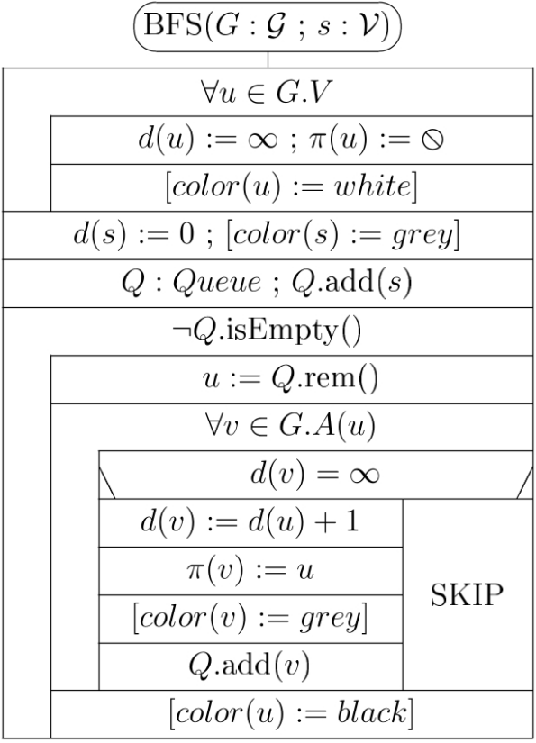

<!-- <object data="ad2jegyzet.pdf#page=45" type="application/pdf" width="500" height="300"></object> -->

Általában, mikor a sort már az s-től k távolságra levő csúcsok alkotják, megkezdődik azoknak a feldolgozása.
Közben az s-től d = k+1 távolságra lévő csúcsokat találjuk meg, beállítjuk a címkéiket és a sor végére tesszük őket.
Mire az s-től k távolságra levő csúcsokat feldolgozzuk, a sort már az s-től k+1 távolságra levő csúcsok alkotják stb.

Azt mondjuk, hogy az s-től k távolságra levő csúcsok vannak a gráf k-adik szintjén.
Így a BFS a gráfot szintenként járja be, először a nulladik szintet, aztán az elsőt, majd a másodikat stb.
Minden szintet teljesen feldolgoz, mielőtt a következőre lépne, közben pedig éppen a következő szinten levő csúcsokat találja meg.
Innét jönnek a szélességi bejárás és a szélességi keresés elnevezések.

Mivel a gráf véges, végül nem lesz már k + 1 távolságra levő csúcs, Q kiürül és a BFS megáll.
Azokat a csúcsokat, amelyek s-ből elérhetők, az algoritmus valamelyik szinten meg is találja, és megfelelően beállítja a d és a $\pi$ címkéiket is.
A többi csúcs tehát s-ből nem érhető el. Ezekre $d = \infty$ és $\pi = \oslash$ marad.

#### **Alkalmazásai**
##### **Szélességi fa (breadth-first tree)**
Több csúcsnak is lehet ugyanaz szülője, a szülőcsúcs viszont a BFS által meghatározott legrövidebb utakon egyértelmű.

Az s-ből elérhető csúcsok hivatkozásai tehát egy általános fát definiálnak, aminek a gyökere s.

Ezt a fát szélességi fának és legrövidebb utak fájának is nevezzük, mivel - fordított irányban - mindegyik, az s-ből elérhető csúcsra a BFS által meghatározott legrövidebb utakat tartalmazza.

Ez a fordított ábrázolás azért célszerű, mert minden csúcsnak legfeljebb egy szülője, viszont több gyereke is lehet, így tehát tömörebb ábrázolás érhető el.

#### **Műveletigény**
A csúcsok száma n, az élek száma m.
Az első, az inicializáló ciklus n-szer iterál.
A második, a fő ciklus annyiszor iterál, ahány csúcs elérhető s-ből (önmagát is számítva), ami legfeljebb szintén n, minimum 1.

Irányított gráfoknál a belső ciklus legfeljebb m-szer iterál összesen (ha s-ből mindegyik csúcs elérhető, akkor minden él sorra kerül).
Irányítatlan gráfoknál pedig belső ciklus legfeljebb 2m-szer iterál összesen (ha s-ből mindegyik csúcs elérhető, akkor minden él sorra kerül mindkét irányból).
Az is lehetséges viszont, hogy a belső ciklus egyszer sem iterál (ha s-ből nem megy ki egyetlen él sem).

Összefoglalva: $mT(n, m) \in \Theta(n)$ és $MT(n, m) \in \Theta(n + m)$.


### Mélységi bejárás (DFS: Depth-first Search)
A gráf összes csúcsát és élét érinti.
Mi csak egyszerű irányított gráfokra értelmezzük.
Csúcsok címkéi:
- d: elérési idő (discovery time)
- f: befejezési idő (finishing time)
- $\pi$: melyik csúcsból jutunk közvetlenül a csúcsba (ki a szülője)
- color:
  - fehér: érintetlen
  - szürke: belőle elérhető csúcsokat járunk be éppen
  - fekete csúcs: befejeztük

#### **Algoritmus**
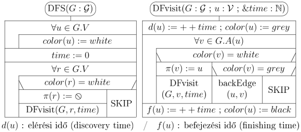

#### **Alkalmazásai**
##### **Mélységi feszítő erdő (depth-first forest)**
Mindegyik, a DFS eljárásból indított DFvisit egy-egy mélységi fát számol ki.
Ezek együtt adják a mélységi feszítő erdőt.

- $r \in G.V$ egy mélységi fa gyökere $\Leftrightarrow \pi(r) = \oslash$
- $(u,v) \in G.E$ egy mélységi fa éle $\Leftrightarrow u = \pi(v)$

##### **Az élek osztályozása (classification of edges)**
Osztályozás:
- $(u,v)$ fa-él (tree edge) $\Leftrightarrow$ $(u,v)$ valamelyik mélységi fa egyik éle (a fa-élek mentén járjuk be a gráfot)
- $(u,v)$ vissza-él (back edge) $\Leftrightarrow$ v az u őse egy mélységi fában
- $(u,v)$ előre-él (forward edge) $\Leftrightarrow$ $(u,v)$ nem fa-él, de v az u leszármazottja egy mélységi fában
- $(u,v)$ kereszt-él (cross edge) $\Leftrightarrow$ u és v két olyan csúcs, amelyek ugyanannak a mélységi fának két különböző ágán vannak, vagy két különböző mélységi fában találhatók.

Felismerés:
- $(u,v)$ fa-él (tree edge) $\Leftrightarrow$a v csúcs még fehér
- $(u,v)$ vissza-él (back edge) $\Leftrightarrow$ a v csúcs éppen szürke
- $(u,v)$ előre-él (forward edge) $\Leftrightarrow$ a v csúcs már fekete és d(u) < d(v)
- $(u,v)$ kereszt-él (cross edge) $\Leftrightarrow$ a v csúcs már fekete és d(u) > d(v).

##### **A DAG tulajdonság eldöntése**
A G irányított gráf akkor **DAG** (directed acyclic graph, körmentes irányított gráf), ha nem tartalmaz irányított kört.

Amennyiben a mélységi bejárás egy $(u,v)$ vissza-élt talál, azzal irányított kört is talált a gráfban.

A G irányított gráf DAG $\Leftrightarrow$ G-ben vissza-élt.

Ha a DFS talál egy $(u,v)$ vissza-élt, akkor az $\left< u, \pi(u), \pi(\pi(u)), \cdots, v, u  \right>$ csúcssorozat visszafelé olvasva egyszerű irányított kört ad.

##### **Topologikus rendezés**
Irányított gráf **topologikus rendezése** alatt a gráf csúcsainak olyan sorba rendezését értjük, amelyben minden él egy-egy később jövő csúcsba (szemléletesen: balról jobbra) mutat.

Egy gráfnak lehet több topologikus rendezése is.

Egy irányított gráfnak van topologikus rendezése $\Leftrightarrow$ nincs irányított kör a gráfban (a gráf DAG).

Algoritmus:
létrehozunk egy üres vermet, majd végrehajtuk gráf mélységi bejárását úgy, hogy valahányszor befejezünk egy csúcsot, a verem tetejére tesszük.
Végül a verem tartalmát kiolvasva megkapjuk a gráf csúcsainak topologikus rendezését.
Ha a DFS vissza-élt talál, akkor nincs topologikus rendezés, a verem tartalma nem használható fel.

#### **Műveletigény**
A csúcsok száma n, az élek száma m.
A DFS mindkét ciklusa n-szer fut le.
Összesen n-szer hívódik meg a DFvisit rekurzív eljárás.
A DFvisit ciklusa mindegyik csúcsra annyit iterál, amennyi a kimeneti fokszáma.
Ez a ciklus tehát a gráf éleit dolgozza fel, mindegyiket egyszer.
Ennélfogva összesen m iterációt végez.

Összefoglalva: 3n+m+1 lépés, ezért $mT(n), MT(n) \in \Theta(n + m)$.


## Minimális feszítőfák
A lehető legkisebb építési költséggel szeretnénk elérni, hogy tetszőleges csúcsból bármelyik másikba el lehessen jutni.
A feladat megoldása céljából definiáljuk a minimális feszítőfa (MST = Minimum Spanning Tree) fogalmát.
Itt tetszőleges összefüggő, irányítatlan, élsúlyozott gráf minimális feszítőfáját keressük (az élsúlyok negatívak is lehetnek).

A $G = (V, E)$ irányítatlan gráf **feszítő erdeje** a $T = (V, F)$ gráf, ha $F \subseteq E$, valamint T erdő (azaz T olyan gráf, aminek mindegyik komponense fa, a fák páronként diszjunktak, és együtt éppen lefedik a G csúcshalmazát).

A $G = (V, E)$ irányítatlan, összefüggő gráf **feszítőfája** a $T = (V, F)$ gráf, ha $F \subseteq E$, és T fa.

Amennyiben $G = (V, E)$ élsúlyozott gráf (fa, erdő stb.) $w: \rightarrow \mathbb{R}$ súlyfüggvénnyel, akkor a **G súlya** az élei súlyainak összege:
$$w(G) = \sum\limits_{e \in E} w(e)$$

A G irányítatlan, összefüggő, élsúlyozott gráf **minimális feszítőfája** (minimum spanning tree, MST) T, ha T a G feszítőfája, és G bármely T' feszítőfájára $w(T) \leq w(T')$.

### Általános algoritmus
Az $A = \{ \}$ üres élhalmazból indul, és ezt úgy bővíti újabb és újabb élekkel, hogy A végig a G összefüggő, irányítatlan, élsúlyozott gráf valamelyik minimális feszítőfája élhalmazának a részhalmaza marad: az így választott éleket nevezzük az A élhalmazra nézve biztonságosnak (safe for A). Amikor az élek száma eléri a $|G.V| – 1$ értéket, az A szükségszerűen feszítőfa, és így minimális feszítőfa is lesz.

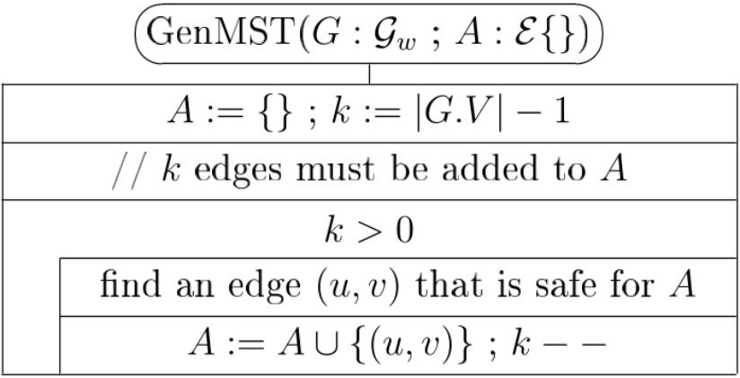

#### **Biztonságos él választása**

Tegyük fel, hogy $G = (V, E)$ élsúlyozott, irányítatlan, összefüggő gráf, és $A \subseteq$ a G valamelyik minimális feszítőfája élhalmazának.
Ekkor az $(u,v) \in E$ él **biztonságosan hozzávehető** az A élhalmazhoz (safe for A), ha $(u,v) \notin A$ és $A \cup \{(u,v)\} \subseteq$ a G valamelyik (az előzővel nem okvetlenül egyező) minimális feszítőfája élhalmazának.

Ha $G = (V, E)$ gráf és $\{\} \subsetneq S \subsetneq V$, akkor a G gráfon $(S, V \setminus S)$ egy **vágás**.

A $G = (V, E)$ gráfon az $(u,v) \in E$ él **keresztezi** az $(S, V \setminus S)$ vágást, ha $(u \in S \land v \in V \setminus S) \lor (u \in V \setminus S \land v \in S)$.

A $G = (V, E)$ élsúlyozott gráfon az $(u,v) \in E$ **könnyű él** az $(S, V \setminus S)$ vágásban, ha $(u,v)$ keresztezi a vágást, és $\forall (p, q)$, a vágást keresztező élre $w(u,v) \leq w(p,q)$.

A $G = (V, E)$ gráfban az $A \subseteq E$ élhalmazt **elkerüli** az $(S, V \setminus S)$ vágás, ha az A egyetlen éle sem keresztezi a vágást.

Ha a $G = (V, E)$ irányítatlan, összefüggő, élsúlyozott gráfon
1. A részhalmaza a G valamelyik minimális feszítőfája élhalmazának,
2. az $(S, V \setminus S)$ vágás elkerüli az A élhalmazt, és
3. az $(u,v) \in E$ könnyű él az $(S, V \setminus S)$ vágásban

$\Rightarrow$ az (u,v) él **biztonságosan hozzávehető** az A élhalmazhoz.

### Kruskal algoritmusa
Kruskal algoritmusa a $G = (V, E)$ gráf éleit a súlyuk (hosszuk) szerint monoton növekvően veszi sorba.
Azokat az éleket eldobja, amelyek az A bizonyos éleivel együtt kört képeznének, a többit hozzáveszi A-hoz.

A $G = (V, E)$ gráf **feszítő erdeje** a $(V, A)$ gráf, ha egymástól diszjunkt fákból, mint komponensekből áll, és $A \subseteq E$ (két fa egymástól diszjunkt, ha nincs közös csúcsuk [és így közös élük sem]).

A **Kruskal algoritmus invariánsa**, hogy $(V, A)$ a $G = (V, E)$ összefüggő, irányítatlan, élsúlyozott gráf feszítő erdeje, és A részhalmaza a G valamelyik minimális feszítőfája élhalmazának.


#### **Algoritmus**
$A = \{\}$-val indulunk, ami azt jelenti, hogy kezdeti feszítő erdő fái a $G = (V, E)$ gráf egycsúcsú fái.
A G gráf éleit súlyuk (hosszuk) szerint monoton növekvően vesszük sorba, és tetszőleges élet pontosan akkor veszünk hozzá A-hoz, ha a (V, А) erdő két fáját köti össze (azaz nem egy fán belül fut, és így nem zár be egyetlen kört sem).

Ezért minden egyes él hozzávételével eggyel csökken az erdő fáinak száma, de továbbra is feszítő erdőt alkotnak.
Mivel G összefüggő, bármelyik két fa között van út, így előbb-utóbb összekapcsolódnak és már csak egy T fából áll az erdő, T feszítőfa.

A fenti invariáns miatt a T élhalmaza részhalmaza valamelyik M minimális feszítőfa élhalmazának.
A G minden feszítőfájának $|V| – 1$ éle van, így a T és M élhalmaza megegyezik.
Mindkettő csúcshalmaza V, tehát T = M, azaz T minimális feszítőfa.

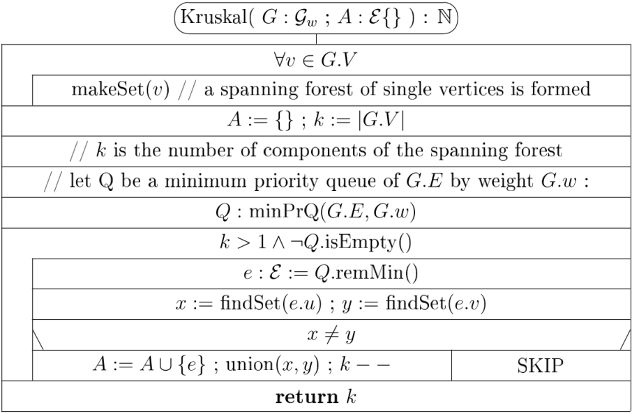

Az algoritmus ellenőrzi, hogy G összefüggő-e.
Ha összefüggő, k = 1 értékkel tér vissza, ha nem, k > 1 lesz.

#### Halmazműveletek
"Unió - hol van" adatszerkezet.
- makeSet(v): $\Theta(1)$ műveletigénnyel létrehoz egy egyelemű halmazt, ami csak a v csúcsot tartalmazza
- findSet(v): $O(\log n)$ műveletigénnyel meghatározza a v csúcsot tartalmazó komponens reprezentáns elemét
- union(x, y): $\Theta(1)$ műveletigénnyel uniózza az x és az y csúcsok által reprezentált diszjunkt halmazokat, és beállítja az új halmaz reprezentáns elemét (a nagyobb alá csatolja a kisebb fát (s(r) az r által reprezentált fa mérete))

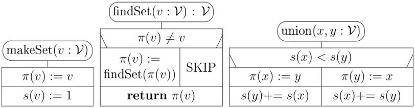

A csúcshalmazokat a reprezentáns elemük felé irányított fákkal ábrázoljuk.
Mindegyik csúcsnak van egy címkéje, aminek értéke az ő szülője, kivéve az irányított fák gyökércsúcsait.
Mindegyik irányítatlan fát a neki megfelelő irányított fa gyökércsúcsával azonosítjuk be.

#### Műveletigény
A csúcsok száma n, az élek száma m.
Feltételezzük, hogy a makeSet(v) és a union(x, y) eljárások futási ideje $\Theta(1)$, a findSet(v) függvényé pedig $O(\log n)$.
A prioritásos sort bináris kupaccal valósítjuk meg, így (mivel a gráf éleit tároljuk benne) inicializálása $\Theta(m)$, remMin() művelete pedig $O(\log m)$ időt igényel.

Az első ciklus műveletigénye $\Theta(n)$, a két ciklus közti részé pedig $\Theta(m)$ (a kupac inicializációja miatt).

A fő ciklust megelőző inicializációk műveletigénye nagyságrendekkel kisebb, mint a fő ciklusé.
A fő ciklus egy iterációja $O(\log n)$ időt igényel, és mivel legfeljebb m-szer iterál, a teljes műveletigénye (és így az egész algoritmusé is) $O(m * \log n)$.

### Prim algoritmusa
Kijelölünk a $G = (V, E)$ összefüggő, élsúlyozott, irányítatlan gráfban egy tetszőleges $r \in V$ csúcsot.
A $T = (\{r\}, \{\})$, egyetlen csúcsból álló fából kiindulva építünk fel egy minimális $(V, F)$ feszítőfát: minden lépésben a $T = (N, A)$ fához egy újabb biztonságos élet és hozzá tartozó csúcsot adunk.

Ez azt jelenti, hogy a $T = (N, A)$ fa végig ennek a minimális feszítőfának ($(V, F)$) a része marad, azaz végig igaz az $N \subseteq V \land A \subseteq F$ invariáns. Ehhez mindegyik lépésben egy könnyű élet választunk ki az $(N, V \setminus N)$ vágásban.

A megfelelő könnyű él hatékony meghatározása céljából egy Q minimum prioritásos sorban (c(u) alapján) tartjuk nyilván a feldolgozatlan csúcsokat (($V \setminus N$) csúcshalmazt).

Mindegyik $u \in V \setminus N$ (prioritásos sorban lévő) csúcshoz tartozik egy $c(u)$ és egy $p(u)$ címke.
Ha van él az u csúcs és a T fa N csúcshalmaza között ($(N, V \setminus N)$ vágásban), akkor $(p(u), u)$ a minimális súlyú él azok között, amelyek az u csúcsot a T fához kapcsolják és $c(u) = w(p(u), u)$.

Az eredetileg egyetlen csúcsból álló T fa, n–1 db ilyen $(p(u), u)$ él hozzáadásával MST (minimális feszítőfa) lesz.

#### Algoritmus
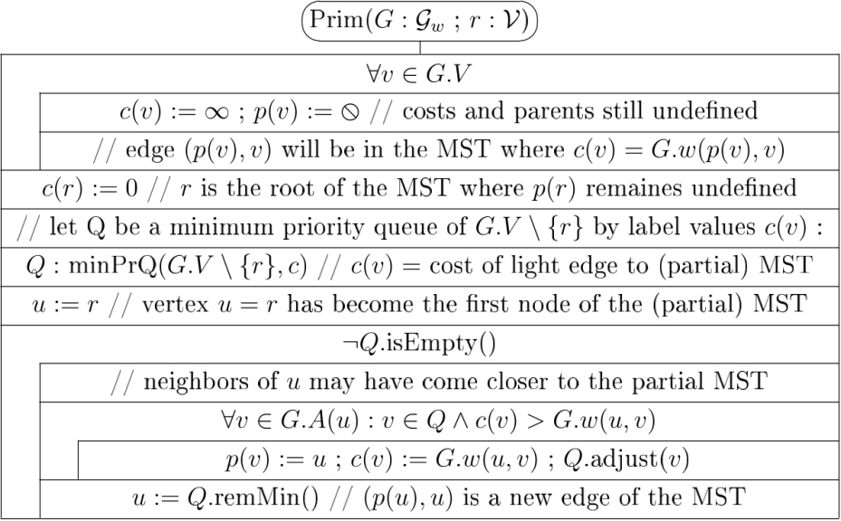

#### Műveletigény
A csúcsok száma n, az élek száma m.
A prioritásos sort bináris kupaccal valósítjuk meg.

Az első ciklus műveletigénye $\Theta(n)$, a két ciklus közti részé pedig $\Theta(m)$ (a kupac inicializációja miatt).

A második ciklus n-1-szer fut le, az elem kivétele $O(\log n)$ műveletigényű, így összesen $O(n * \log n)$

A belső ciklus a gráf minden élére legfeljebb kétszer fog lefutni (2m), hiszen mindegyik élet mindkét végpontja felől megtaláljuk (kivéve azokat, amelyek egyik végpontja a Q-ban utoljára megmaradt csúcs).
A Q.adjust(v) utasítás műveletigénye $O(\log n)$.
A belső ciklus tehát, biztosan lefut $O(m * \log n)$ idő alatt.

Összesen tehát: $MT(n, m) \in O(m * \log n)$.

## Legrövidebb utak egy forrásból
A $G: \mathcal{G}_w$ gráf tetszőlegesen rögzített s start csúcsából (source vertex) legrövidebb, azaz optimális utat keresünk mindegyik, az s-ből G-ben elérhető csúcsba.

Az irányítatlan gráfokat olyan irányított gráfoknak tekintjük, ahol a gráf tetszőleges $(u,v)$ élével együtt $(v, u)$ éle a gráfnak, és $w(u,v) = w(v,u)$.

A feladat pontosan akkor oldható meg, ha G-ben nem létezik s-ből elérhető negatív kör, azaz olyan kör, amely mentén az élsúlyok összege negatív. Mivel az irányítatlan gráfokat speciális irányított gráfoknak tekintjük, ez a feltétel irányítatlan gráfok esetében azt jelenti, hogy feladatot akkor tudjuk megoldani, ha nincs a gráfban s-ből elérhető negatív él.

Amennyiben a feladat megoldható, mindegyik $v \in G.V \setminus \{s\}$ csúcsra:
- ha létezik út s-ből v-be:
  - $d(v)$: optimális út hossza
  - $\pi(v)$: az optimális úton a v csúcs közvetlen megelőzője
- ha nem létezik út:
  - $d(v) = \infty$
  - $\pi(v) = \oslash$

Az s csúcsra a helyes eredmény $d(v) = \infty$ és $\pi(v) = \oslash$.

A legrövidebb utakat kereső algoritmusok futása során az optimális utakat fokozatosan közelítjük.
Jelölje $s \rightsquigarrow v$ az adott pillanatig kiszámolt s-ből v-be vezető legrövidebb utat.

Az optimális utak fokozatos közelítéséhez a gráf $(u,v)$ éleit szisztematikusan vizsgáljuk, és ha $s \rightsquigarrow u \rightarrow v$ rövidebb mint $s \rightsquigarrow v$, akkor az előbbi lesz az új $s \rightsquigarrow v$ (**közelítés**, relaxation).

Az algoritmusok közös vonása még, hogy ismételten kiválasztanak
és kivesznek egy csúcsot a feldolgozandó csúcsok halmazából, és a csúcsból kimenő összes élre végeznek közelítést.
Ezeket a közelítéseket együtt a csúcs **kiterjesztésének** nevezzük, míg a csúcs kiválasztását (és kivételét a feldolgozandók közül) a kiterjesztésével együtt a **feldolgozásának** nevezzük.

### Dijkstra algoritmusa
Előfeltétel: a gráf mindegyik élének élsúlya nemnegatív.
Ebben az esetben nem lehet a gráfban negatív kör, tehát a legrövidebb utak egy forrásból feladat megoldható.

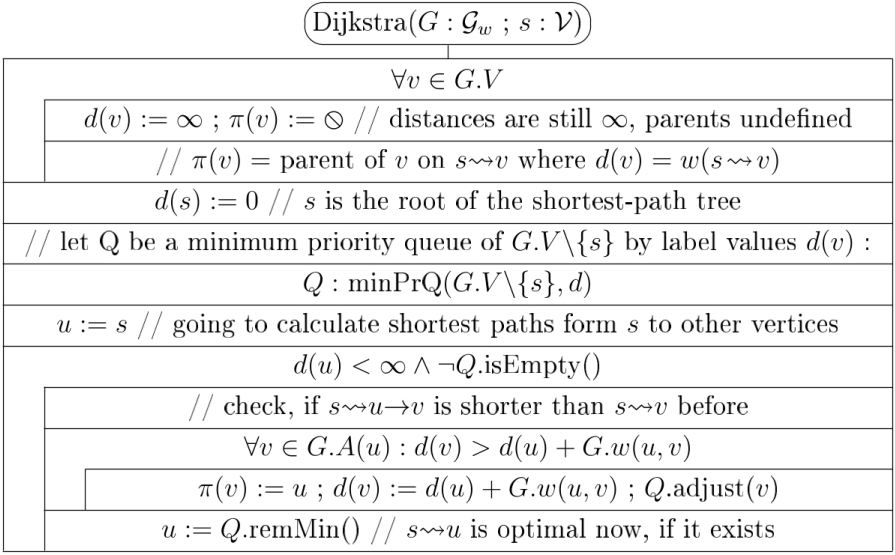

Amíg a kiterjesztésre kiválasztott u csúcsra $d(u) < \infty$, addig olyan csúcsot választunk ki, amelyikbe már optimális utat találtunk.

Ha $d(u) < \infty$ mindegyik kiválasztott csúcsra igaz, akkor és csak akkor az algoritmus (második ciklusa) n-1 iterációval kiüríti Q-t, és megáll, miután gráf mindegyik csúcsába optimális utat talált.


Ha pedig egyszer a kiterjesztésre kiválasztott u csúcsra már $d(u) = \infty$, akkor $Q \cup \{u\}$ egyetlen eleme sem érhető már el az s csúcsból.


#### **Műveletigény**
Az első ciklus műveletigénye $\Theta(n)$, a másodiké $O(\log n)$ (csak a remMin()), ha nincs a gráfban s-nek rákövetkezője.
$mT(n, m) \in \Theta(n)$

Hasonlóan a Prim algoritmushoz, $MT(n, m) \in O((n + m) * \lg n)$.

### DAG legrövidebb út
Előfeltétel: a $G: \mathcal{G}_w$ gráf irányított, és a gráfban nincs s-ből elérhető irányított kör.
Ebben az esetben nincs a gráfban s-ből elérhető negatív kör sem, így a legrövidebb utak egy forrásból feladat megoldható.

Az algoritmus ellenőrzi az előfeltételét. A visszatérési értékben a negatív kört adja vissza, $\oslash$-t, ha nincs benne.

#### **Algoritmus**
Először topologikusan rendezzük az s-ből elérhető részgráfot.
Ezután - a szokásos inicializálásokat követően - a csúcsokat a topologikus sorrendjüknek (S) megfelelően terjesztjük ki.

A topologikus rendezés csak az s-ből elérhető részgráfot próbálja topologikusan rendezni.

A time változó szemlélető célú, elhagyható.

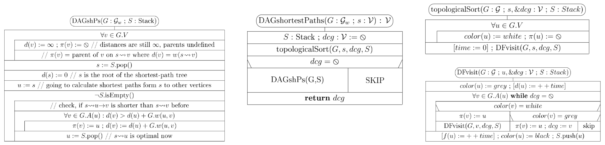

#### **Műveletigény**
$mT(n, m) \in \Theta(n)$ és $MT(n, m) \in \Theta(n + m)$.

### Sor alapú Bellman-Ford
Előfeltétel: Nincs az s-ből elérhető negatív kör (irányított gráf esetén lehetnek negatív élsúlyok).

A QBF hasonlít a szélességi kereséshez, de az utak hosszát a Dijkstra, a DAGshP algoritmushoz hasonlóan, az út menti élsúlyok összegeként határozza meg.

#### **Algoritmus**
Kezdetben csak az s start csúcsot teszi a sorba.
A BFS-hez hasonlóan a szokásos inicializálások után, a fő ciklusban mindig kiveszi a sor első elemét és kiterjeszti, de most mindegyik közvetlen rákövetkezőjére meg is vizsgálja, nem talált-e bele rövidebb utat mint eddig, és ha igen, megfelelően módosítja a d és a  $\pi$ értékét.
Ha a módosított d és a értékű csúcs pillanatnyilag nincs benne a sorban, beteszi a sor végére.

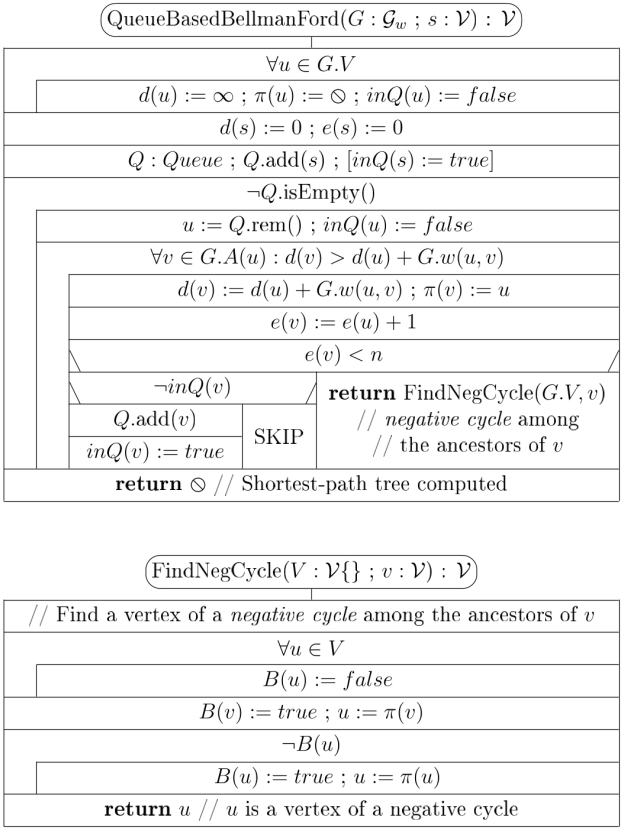

#### **Negatív körök kezelése**
Bevezetjük a gráf v csúcsaira az e(v) címkét: ennyi élt tartalmaz $s \rightsquigarrow v$.

Ha nincs a gráfban s-ből elérhető negatív kör, akkor minden, a fő ciklusban kezelt v csúcsra $e(v) < n$, a visszatérési érték ilyenkor $\oslash$.

Ellenkező esetben $e(v) \geq n$.
Ilyenkor ez a v csúcs vagy része egy negatív körnek, vagy el lehet belőle jutni egy negatív körbe, ezért ezzel térünk vissza.

#### **Műveletigény**
A **menet** rekurzív definíciója:
- A 0. menet: a start csúcs (s) feldolgozása
- (i+1). menet: az i. menet végén a sorban levő csúcsok feldolgozása

Ha s-ből nem érhető el negatív kör, akkor tetszőleges s-ből elérhető u csúcsra van olyan $s \rightsquigarrow (opt) \rightsquigarrow u$ út, amit az n–1. menet elejére már a QBF kiszámolt $\Rightarrow$ az n-1. menet végére kiürül a sor, az algoritmus pedig $O(n * m)$ időben megáll.

Ezért $MT(n, m) \in O(n * m)$.


## Legrövidebb utak minden csúcspárra
Ezek az algoritmusok a gráfok csúcsmátrixos reprezentációjára épülnek, műveletigényük $\Theta(n^3)$.
Az irányítatlan gráfokat olyan irányított gráfnak tekintjük, amelyben minden $(u,v)$ élnek megvan az ellentétes irányú $(v,u)$ élpárja és $w(u,v) = w(v,u)$.

### Floyd-Warshall algoritmus
Előfeltétel: A gráfban nincs negatív kör (ezt az algoritmus ellenőrzi).

A gráf csúcsait 1-től n-ig indexeljük és a csúcsokat az indexükkel azonosítjuk.

Az algoritmus a $\left<(D^{(0)}, \pi^{(0)}), (D^{(1)}, \pi^{(1)}), \cdots, (D^{(n)}, \pi^{(n)})\right>$ mátrixpársorozatot állítja elő. Az optimális utakat úgynevezett belső csúcsok mentén keressük.

Belső csúcs egy $p = \left<v_1, v_2, \cdots, v_k\right>$ út belső csúcsa minden $v_1$-től és $v_k$-tól különböző csúcs.

$i \rightsquigarrow \xrightarrow{k} \rightsquigarrow j$ az i csúcsból a j csúcsba vezető út, azzal a megszorítással, hogy az úton a közbenső (belső) csúcsok indexe $< k$ (a végpontos lehetnek nagyobbak).

$i \rightsquigarrow \xrightarrow[opt]{k} \rightsquigarrow j$ az i csúcsból a j csúcsba vezető legrövidebb körmentes út, azzal a megszorítással, hogy az úton a közbenső csúcsok indexe $\leq k$.

A k-adik lépése után a $D^{(k)}_{ij}$ az i és j csúcsok között lévő szuboptimális út hosszát tartalmazza, azzal a megszorítással, hogy a belső csúcsok címkéje legfeljebb k.

##### Invariáns
$$
D^{(k)}_{ij}=
\begin{cases}
w(i \rightsquigarrow \xrightarrow[opt]{k} \rightsquigarrow j) & \text{ha létezik } i \rightsquigarrow \xrightarrow{k} \rightsquigarrow j \\
\infty & \text{ha nem létezik } i \rightsquigarrow \xrightarrow{k} \rightsquigarrow j
\end{cases}
$$

$$
\pi^{(k)}_{ij}=
\begin{cases}
\text{az } i \rightsquigarrow \xrightarrow[opt]{k} \rightsquigarrow j & \text{úton a j csúcs közvetlen megelőzője,} \\& \text{ha létezik } i \rightsquigarrow \xrightarrow{k} \rightsquigarrow j \\
0 & \text{ha } i = j \text{ vagy nem létezik } i \rightsquigarrow \xrightarrow{k} \rightsquigarrow j
\end{cases}
$$

##### Kezdő- és végállapot
A $D^{(0)}$ mátrix megegyezik a gráf A csúcsmátrixával, a $D^{(n)}$ mátrix pedig éppen a kiszámítandó D mátrix.

$$
\pi^{(0)}_{ij}=
\begin{cases}
i & \text{ha } i \neq j \land (i,j) \text{ a gráf éle} \\
0 & \text{ha } i = j \lor (i,j) \text{ nem a gráf éle} \\
\end{cases}
$$

A $\pi^{(n)}$ mátrix pedig megegyezik a kiszámítandó $\pi$ mátrixszal.

##### A k. állapot kiszámítása
$$
D^{(k)}_{ij}=
\begin{cases}
D^{(k-1)}_{ik} + D^{(k-1)}_{kj} & \text{ha } D^{(k-1)}_{ij} > D^{(k-1)}_{ik} + D^{(k-1)}_{kj} \\
D^{(k-1)}_{ij} & \text{különben}
\end{cases}
$$

$$
\pi^{(k)}_{ij}=
\begin{cases}
\pi^{(k-1)}_{kj} & \text{ha } D^{(k-1)}_{ij} > D^{(k-1)}_{ik} + D^{(k-1)}_{kj} \\
\pi^{(k-1)}_{ij} & \text{különben}
\end{cases}
$$

Az aktuális iterációban a D és $\pi$ k. sora és a k. oszlopa nem változik.

Mivel az aktuális iterációban számolt mátrix ($D^{(k)}$) értékei az előző mátrix ($D^{(k-1)}$) azon értékeitől függnek, amelyek nem változnak, ezért nem szükséges segédmátrixot tárolni.

#### **Algoritmus**
Az algoritmus a k. lépésben azt vizsgálja meg, hogy az i-ből j-be vezető legrövidebb út javítható-e, ha megengedjük, hogy a k indexű csúcs is a két csúcs közötti út egyik csúcsa legyen.
Az algoritmus fokozatosan "engedélyezi" az egyre nagyobb indexű belső csúcsokat.

##### Példa

```cpp
// a zárójel nélküli számok a csúcsok
// a zárójeles számok a súlyok
 1--(5)--2
 |       |
(1)     (1)
 |       |
 3--(2)--4
```

Itt például az 1-es és 4-es csúcs közötti valódi legrövidebb út: $1 \rightarrow 3 \rightarrow 4$, súlya $1 + 2 = 3$.

Viszont amit az algoritmus gondol:
- **k = 1. iteráció:** mivel 1 és 4 között olyan utat keresünk, amin csak olyan csúcsok engedélyezettek, amelyeknek az indexe maximum k = 1, és nincs ilyen út, ezért az algoritmus azt hiszi, hogy nincs köztük út, távolságuk $\infty$.
- **k = 2. iteráció:** engedélyezzük a 2-es számú csúcsot. Mivel van a gráfban egy olyan (az eddiginél rövidebb) út a két végpont között, amelyen a csúcsok indexe maximum 2 ($1 \rightarrow 2 \rightarrow 4$), ezért új, rövidebb utat találtunk. Az új út súlya $5 + 1 = 6$.
- **k = 3. iteráció:** engedélyezzük a 3. csúcsot. A gráfban van olyan (az eddiginél rövidebb) út 1 és 4 között, amelyen a csúcsok indexe maximum 3 ($1 \rightarrow 3 \rightarrow 4$), ezért új, rövidebb utat találtunk. Az új út súlya $1 + 2 = 3$.
- **k = 4. iteráció**: ennél az útvonalnál már nem találunk rövidebbet.

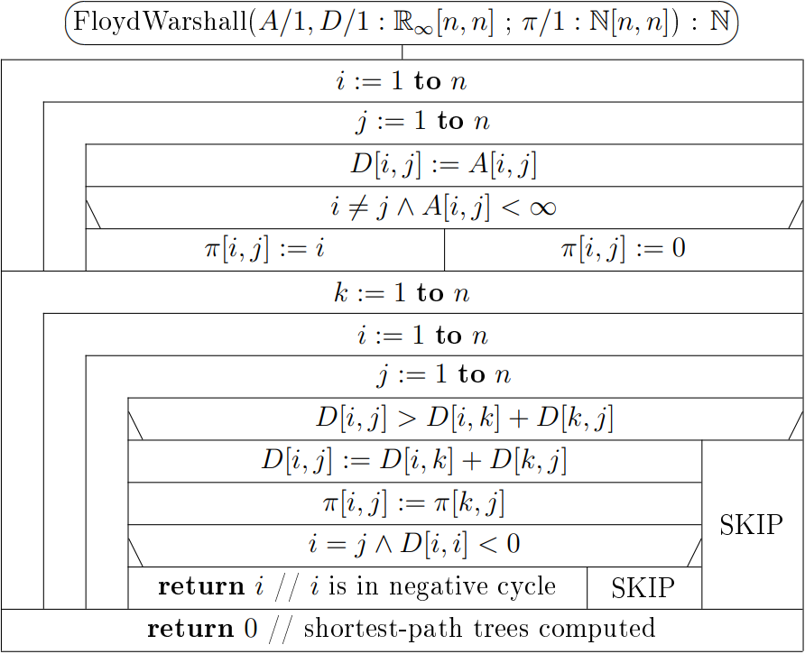

#### **Műveletigény**
Az első ciklus műveletigénye $\Theta(n^2)$.
Ha a gráfban nincs negatív kör, akkor a második ciklus műveletigénye $\Theta(n^3)$, ami a teljes algoritmus műveletigénye is: $MT(n) \in \Theta(n^3)$.

Ha a gráfban van negatív kör, ez akár a 2. ciklus első iterációja alatt kiderülhet, ezért $mT(n) \in \Theta(n^2)$.

### Gráf tranzitív lezártja
Az algoritmus megadja, hogy egy gráfban honnan hova lehet eljutni. Az eljutás módjával és költségével nem foglalkozunk.

A $G = (V, E)$ gráf **tranzitív lezártja** alatt a $T \subseteq V \times V$ relációt értjük, ahol: $(u,v) \in T \Leftrightarrow$ G-ben az u csúcsból elérhető a v csúcs.

Az algoritmus a $\left< T^{(0)}, T^{(1)}, \cdots, T^{(n)}\right>$ sorozatot számítja ki.

##### Invariáns
$T^{(k)}_{ij} \Leftrightarrow \exists i \rightsquigarrow \xrightarrow{k} \rightsquigarrow j$

##### A k. állapot kiszámítása, kezdő- és végállapot
$T^{(0)}_{ij} = A[i,j] \lor (i=j)$

$T^{(k)}_{ij} = T^{(k-1)}_{ij} \lor (T^{(k-1)}_{ik} \land T^{(k-1)}_{kj})$

$T^{(n)}$ a keresett T mátrix.

Az aktuális iterációban a T k. sora és a k. oszlopa nem változik.

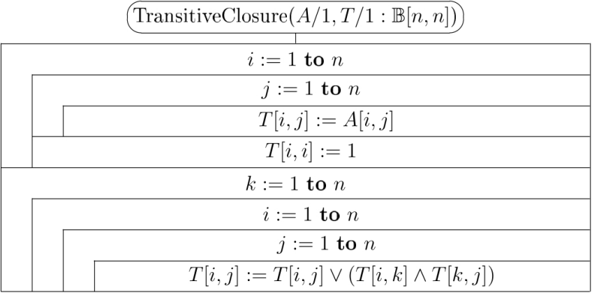

Floyd-Warshall és tranzitív lezárt hasonlósága: $T[i,j] \Leftrightarrow D[i,j] < \infty$.

#### **Műveletigény**
$T \in \Theta(n^3)$ a Floyd-Warshall algoritmusnál látottakhoz hasonlóan (kivéve a negatív kör esetét, olyan itt nem lehetséges).

</div>